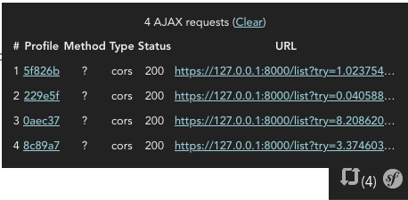

# React Symfony Web Debug Toolbar

[](https://www.npmjs.com/package/@basster/react-symfony-debug-toolbar)

This project aims to help developers who develop a separate SPA frontend against a Symfony Backend, utilizing none of the bundled frontend stacks.

In this case the frontend has its own index.html and cannot profit from Symfonys tremendous [Web Debug Toolbar & Profiler](https://symfony.com/doc/current/profiler.html).

This component to the rescue! 🎉

⚠️ This is an early version and nothing more than a PoC. Please help me to streamline it (especially with UX and styling 😅).

## What it does?

The `<SymfonyWebDebugToolbar />` component intercepts each `XMLHttpRequest` and `window.fetch` call (with a little help from [@mswjs/interceptors](https://www.npmjs.com/package/@mswjs/interceptors)) and looks for `x-debug-token` and `x-debug-token-link` headers in all responses, which are injected into every Symfony response, [if the Profiler Component is installed](https://symfony.com/doc/current/profiler.html#accessing-profiling-data-programmatically), and lists it in nearly the same way as the original Symfony Web Debug Toolbar does.

## How does it look?



## How to install?

```shell
# npm
npm install --save @basster/react-symfony-debug-toolbar

# yarn
yarn add @basster/react-symfony-debug-toolbar
```
